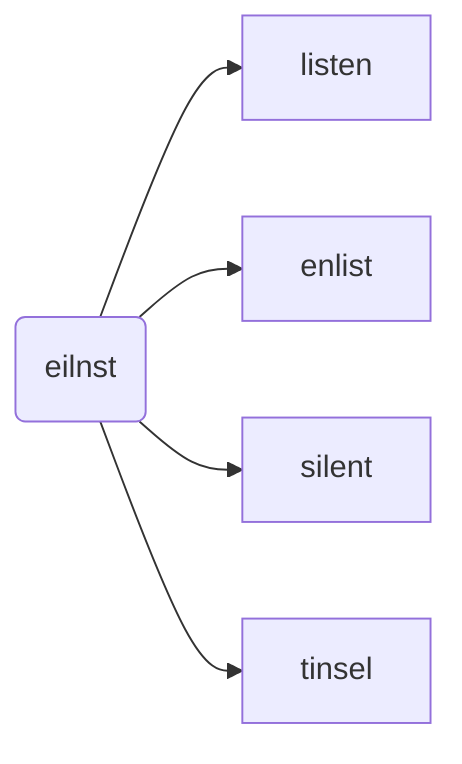

# Design

## Game Rules
Link to official rules: https://bananagrams.com/pages/instructions

We'll play according to classic bananagrams rules.

1. When the game begins, each player is to draw _x_ number of characters from a pile of _n_ characters.
2. Player then begins to form valid words using the _x_ number of characters available. Words can only be formed from left to right of from top to bottom. If player is unable to form any more words with the remaining characters, player can opt to swap one tile from hand with three characters in the pile. If there are less than three characters remaining in the pile (meaning there are insufficient characters for swapping), the player loses and the game exits.
3. Upon using all the characters, player shouts _"peel!"_ and all players draw a tile. Repeat step 2.
4. The first player to finish crafting all the words and shouts _"peel!"_ when the pile is empty is the winner.

## Approach
At the start of the game, our objective should be to form the longest valid word given _x_ characters. We could use breadth-first search (BFS) with backtracking.

For example, suppose we start with the letters `eilnst` (sorted).


Data structure would be: 
```json
{ 
  "eilnst": [
    "listen",
    "enlist",
    "silent",
    "tinsel"
  ]
}
```

Say for example, you are given the characters `eilnstv`. Since no valid word can be formed using all the letters, the approach would be to discard one character, then check again if the remaining characters can form a valid word. Say we discard `v`, then we will be back to the above scenario.
